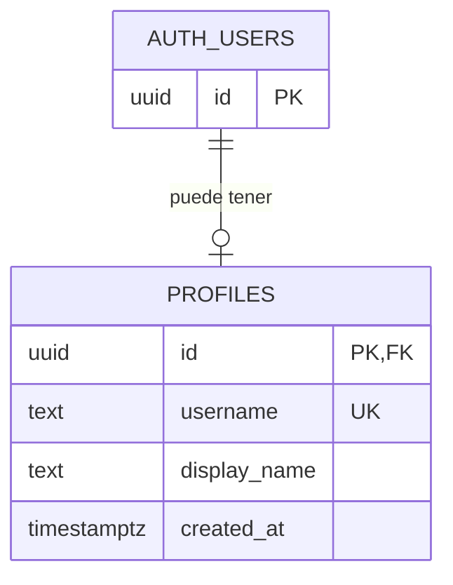
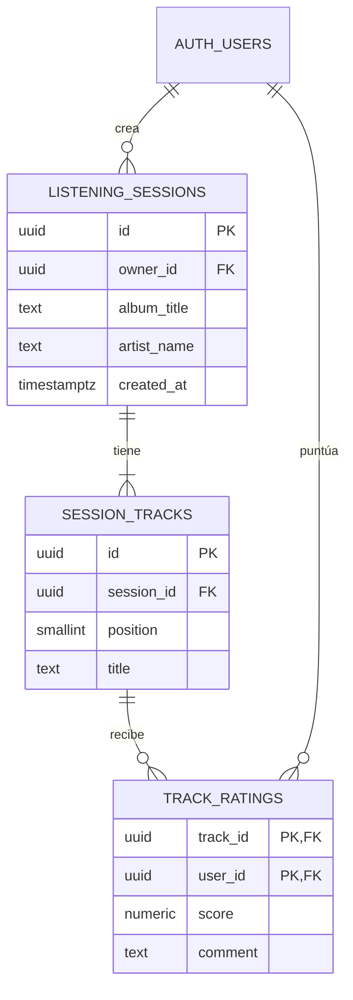

# Base de datos — paso 1: cuenta y perfil

Estado: migración aplicada al proyecto album-rater el 11 de septiembre de 2026.
La app ya crea y recupera perfiles. La prueba completa en iPhone está pendiente.

Migración: `supabase/migrations/20260911000100_create_profiles.sql`.
Pruebas de permisos: `supabase/tests/profiles.sql`.

## Dónde está tu cuenta

En el panel de tu proyecto Supabase, abre **Authentication → Users**.
Allí puedes consultar las cuentas, su identificador, email y estado de confirmación.
Recibir el email no equivale a confirmar la cuenta: la confirmación se completa
al verificar el código.

Supabase guarda las cuentas en PostgreSQL, en la tabla `auth.users`.
`auth` es el esquema (una agrupación de tablas) y `users` es la tabla.
No es necesario crear otra tabla de contraseñas ni modificar la estructura de esta.

Para inspeccionar unos pocos campos desde el SQL Editor, puedes ejecutar esta
consulta de solo lectura:

```sql
select id, email, created_at, email_confirmed_at
from auth.users
order by created_at desc
limit 50;
```

La consulta se ejecuta desde el panel como administrador. No debemos dar a la
app permiso para listar las cuentas o los emails de otros usuarios.

## Cuenta y perfil

Una cuenta permite identificarte y entrar. Un perfil contiene los datos que
eliges mostrar dentro de Album Rater, empezando por tu nombre.

La tabla es `public.profiles`:

| Campo | Tipo | Significado |
| --- | --- | --- |
| `id` | UUID | El mismo identificador que tiene la cuenta en `auth.users`. |
| `username` | Texto obligatorio y único | Identificador elegido por la persona, por ejemplo `jaime_r`. No puede repetirse entre perfiles. |
| `display_name` | Texto | Nombre visible, por ejemplo «Jaime». Entre 1 y 50 caracteres tras quitar espacios de los extremos. |
| `created_at` | Fecha y hora con zona horaria | Momento en que se creó el perfil; lo asigna el servidor. |

Un UUID es un identificador como `8f…`, no un nombre ni un email.
El nombre visible puede repetirse: dos personas pueden llamarse Jaime.
El `username`, en cambio, no puede repetirse. El UUID sigue siendo la clave interna
y no cambia por elegir otro username.

Formato inicial implementado: entre 3 y 30 caracteres, letras
ASCII, números y guion bajo. Se quitan espacios de los extremos y se
guarda en minúsculas: `Jaime` y `jaime` representarían el mismo username.
La base de datos exige `NOT NULL`, `UNIQUE` y el formato acordado mediante
`CHECK`. No basta con comprobar disponibilidad en la pantalla: si dos personas
intentan guardar el mismo username a la vez, solo una escritura puede tener éxito.
La app mostrará «Ese nombre de usuario ya está en uso» sin sobrescribir otro perfil.
La interfaz de esta fase permite crear y leer el perfil. Los permisos también
permiten actualizar username y nombre visible propios; todavía no hay pantalla
de edición. No hay reserva histórica de usernames: al cambiarlo o borrar la
cuenta, queda libre. Las reglas futuras de cambio y reserva deberán definirse
antes de añadir esa interfaz.



`PK` significa que el identificador no puede repetirse dentro de la tabla.
`UK` indica otro valor que tampoco puede repetirse: el username.
`FK` significa que debe corresponder a una cuenta existente.
Así cada cuenta puede tener como máximo un perfil, y no puede existir un perfil
sin cuenta. El email y la contraseña no se copian al perfil.

## Cuándo se crearía el perfil

Después de iniciar sesión, si todavía
no tienes perfil, la app te pide tu nombre visible y tu username, y los guarda. Si ya tienes perfil,
lo recupera. Esto también sirve para la cuenta que ya has creado.

El alta y el perfil son dos pasos: si guardar el perfil falla, puedes reintentarlo
sin volver a crear la cuenta. En esta fase no necesitamos automatismos en el alta.

## Permisos desde el principio

La tabla tiene las siguientes reglas de acceso:

- Sin iniciar sesión, no se puede leer ni escribir ningún perfil.
- Cada persona puede crear, leer y editar solamente su propio perfil.
- El servidor comprueba que el identificador corresponde a la persona autenticada.
- Al eliminar una cuenta, se elimina su perfil asociado.

Estas reglas se aplican con permisos de PostgreSQL y RLS (seguridad por fila).
RLS comprueba qué registros puede usar cada persona, aunque intente saltarse la
interfaz. El nombre `public` del esquema no significa que cualquiera pueda leerlo.

Cuando implementemos amigos, definiremos qué datos pueden ver entre sí.
Las pruebas SQL simulan dos cuentas e intentan acceder al perfil ajeno; al
terminar revierten los datos de prueba.

## Cómo probarlo en la app

1. Ejecuta el proyecto e inicia sesión con tu cuenta existente.
2. Completa nombre visible y username; pulsa Guardar perfil.
3. Cierra sesión y entra otra vez: debe recuperarse el perfil guardado.
4. Con otra cuenta, intenta el mismo username: debe aparecer un aviso.

La app distingue un perfil inexistente de un error de conexión o permisos.
Un fallo de carga muestra Reintentar, sin inventar un perfil vacío. Si la primera
respuesta de guardado se pierde, reintentar recupera el perfil existente sin
sobrescribirlo. El estado se reinicia al cambiar de cuenta.

# Paso 2: reviews individuales

Estado: migración escrita, pendiente de aplicar en Supabase.

Migración: `supabase/migrations/20260928000100_create_solo_reviews.sql`.
Pruebas de permisos: `supabase/tests/reviews.sql`.

Una **sesión de escucha** es una ocasión: volver a escuchar el mismo álbum el año
que viene crea otra sesión y otra entrada en el historial.

| Tabla | Campos | Reglas |
| --- | --- | --- |
| `listening_sessions` | `id`, `owner_id`, `album_title`, `artist_name`, `created_at` | Título y artista de 1 a 200 caracteres, sin saltos de línea. `owner_id` lo asigna el servidor. |
| `session_tracks` | `id`, `session_id`, `position`, `title` | Entre 1 y 100 canciones; posición única por sesión. No se editan. |
| `track_ratings` | `track_id`, `user_id`, `score`, `comment` | Una nota por persona y canción. `score` de 1 a 10 con un decimal como máximo. Comentario opcional de hasta 1000 caracteres. |



## La media del álbum

No hay columna de media. La media es el promedio de las canciones **ya puntuadas**:
con 5 canciones, si solo has puntuado la primera con 9, la media es 9; si puntúas la
segunda con 8, pasa a 8,5. Las canciones sin nota no cuentan. Guardarla aparte
podría dejarla desincronizada de las notas; calcularla siempre da el valor correcto.

## Permisos

- Cada persona solo ve, crea y borra sus propias sesiones, canciones y notas.
- Solo se puede puntuar una canción de una sesión propia.
- No se puede elegir `owner_id` ni `user_id`, ni editar canciones o títulos.
- Borrar una sesión borra sus canciones y notas; borrar la cuenta borra todo lo suyo.

Cuando se compartan sesiones con amigos (milestone 3), la comprobación pasará de
«propietario» a «participante de la sesión». La edición de álbumes y canciones
está fuera de este paso: para corregir un error, se borra el álbum y se crea de nuevo.

Referencia: [Gestión de usuarios en Supabase](https://supabase.com/docs/guides/auth/managing-user-data).
