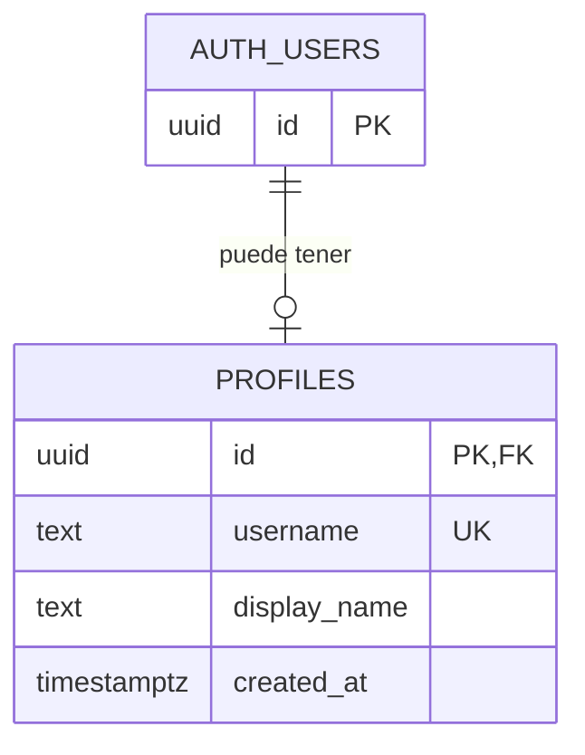

# Base de datos — paso 1: cuenta y perfil

Estado: diseño inicial. Este documento no crea tablas ni modifica Supabase.
El código actual utiliza Supabase Auth; todavía no crea ni consulta perfiles.

## Dónde está tu cuenta

En el panel de tu proyecto Supabase, abre **Authentication → Users**.
Allí puedes consultar las cuentas, su identificador, email y estado de confirmación.
Recibir el email no equivale a confirmar la cuenta: la confirmación se completa
al verificar el código.

Supabase guarda las cuentas en PostgreSQL, en la tabla `auth.users`.
`auth` es el esquema (una agrupación de tablas) y `users` es la tabla.
No es necesario crear otra tabla de contraseñas ni modificar la estructura de esta.

Para inspeccionar unos pocos campos desde el SQL Editor, puedes ejecutar esta
consulta de solo lectura:

```sql
select id, email, created_at, email_confirmed_at
from auth.users
order by created_at desc
limit 50;
```

La consulta se ejecuta desde el panel como administrador. No debemos dar a la
app permiso para listar las cuentas o los emails de otros usuarios.

## Qué añadiríamos primero

Una cuenta permite identificarte y entrar. Un perfil contiene los datos que
eliges mostrar dentro de Album Rater, empezando por tu nombre.

La tabla propuesta es `public.profiles`:

| Campo | Tipo | Significado |
| --- | --- | --- |
| `id` | UUID | El mismo identificador que tiene la cuenta en `auth.users`. |
| `username` | Texto obligatorio y único | Identificador elegido por la persona, por ejemplo `jaime_r`. No puede repetirse entre perfiles. |
| `display_name` | Texto | Nombre visible, por ejemplo «Jaime». Entre 1 y 50 caracteres tras quitar espacios de los extremos. |
| `created_at` | Fecha y hora con zona horaria | Momento en que se creó el perfil; lo asigna el servidor. |

Un UUID es un identificador como `8f…`, no un nombre ni un email.
El nombre visible puede repetirse: dos personas pueden llamarse Jaime.
El `username`, en cambio, no puede repetirse. El UUID sigue siendo la clave interna
y no cambia por elegir otro username.

Propuesta de formato pendiente de confirmar: entre 3 y 30 caracteres, letras
ASCII, números y guion bajo. Se quitarían espacios de los extremos y se
guardaría en minúsculas: `Jaime` y `jaime` representarían el mismo username.
La base de datos exigiría `NOT NULL`, `UNIQUE` y el formato acordado mediante
`CHECK`. No basta con comprobar disponibilidad en la pantalla: si dos personas
intentan guardar el mismo username a la vez, solo una escritura puede tener éxito.
La app mostrará «Ese nombre de usuario ya está en uso» sin sobrescribir otro perfil.
Las reglas para cambiar o reutilizar un username quedan pendientes.



`PK` significa que el identificador no puede repetirse dentro de la tabla.
`UK` indica otro valor que tampoco puede repetirse: el username.
`FK` significa que debe corresponder a una cuenta existente.
Así cada cuenta puede tener como máximo un perfil, y no puede existir un perfil
sin cuenta. El email y la contraseña no se copian al perfil.

## Cuándo se crearía el perfil

Propuesta para la siguiente implementación: después de iniciar sesión, si todavía
no tienes perfil, la app te pide tu nombre visible y tu username, y los guarda. Si ya tienes perfil,
lo recupera. Esto también sirve para la cuenta que ya has creado.

El alta y el perfil son dos pasos: si guardar el perfil falla, puedes reintentarlo
sin volver a crear la cuenta. En esta fase no necesitamos automatismos en el alta.

## Permisos desde el principio

Al crear la tabla, añadiremos también las reglas de acceso:

- Sin iniciar sesión, no se puede leer ni escribir ningún perfil.
- Cada persona puede crear, leer y editar solamente su propio perfil.
- El servidor comprueba que el identificador corresponde a la persona autenticada.
- Al eliminar una cuenta, se elimina su perfil asociado.

Estas reglas se aplicarán con permisos de PostgreSQL y RLS (seguridad por fila).
RLS comprueba qué registros puede usar cada persona, aunque intente saltarse la
interfaz. El nombre `public` del esquema no significa que cualquiera pueda leerlo.

Cuando implementemos amigos, definiremos qué datos pueden ver entre sí.
Primero probaremos estas reglas con dos cuentas, intentando acceder al perfil ajeno.

## Siguiente paso acotado

Crear esta única tabla con sus permisos y conectar guardar/leer el perfil en Swift.
Guardaremos el SQL en el repositorio como una migración: un archivo que deja
registrado exactamente qué estructura y permisos se añadieron.

Álbumes, sesiones y notas se diseñarán en los siguientes pasos, con sus propios
campos y reglas. No forman parte de este cambio.

Referencia: [Gestión de usuarios en Supabase](https://supabase.com/docs/guides/auth/managing-user-data).
